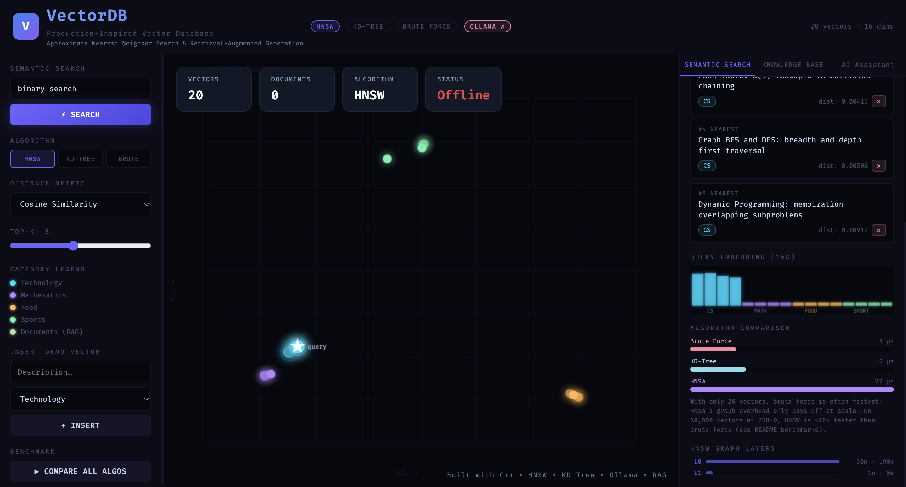

# VectorDB — A Vector Database Built from Scratch in C++

A vector database written from scratch in C++17, with three nearest-neighbour search algorithms (**HNSW**, **KD-Tree**, **Brute Force**), a REST API, a web UI, and a fully local **RAG pipeline** powered by [Ollama](https://ollama.com).

**HNSW search is 10–20× faster than brute force at 100% recall** on 10,000 vectors (see [Benchmarks](#benchmarks)).



## Features

| Feature | Description |
|---|---|
| **3 search algorithms** | [HNSW](#hnsw-hierarchical-navigable-small-world) (approximate, graph-based), [KD-Tree](#kd-tree) (exact, space-partitioning), Brute Force (exact baseline) |
| **3 distance metrics** | Cosine, Euclidean, Manhattan |
| **Live visualization** | 2D PCA scatter plot of the vector space; watch semantic clusters form |
| **Real embeddings** | Paste any text → [`nomic-embed-text`](https://ollama.com/library/nomic-embed-text) turns it into 768-D vectors, auto-chunked into overlapping 250-word pieces |
| **RAG pipeline** | Ask questions about your documents → HNSW retrieves the top chunks → [`llama3.2`](https://ollama.com/library/llama3.2) answers using only that context |
| **REST API** | Insert, delete, search, benchmark and graph-inspection endpoints |
| **Docker Compose** | One command starts Ollama, downloads the models and runs the server |

## How it works

```
Your text ──► Ollama (nomic-embed-text) ──► 768-D vector
                                               │
                                               ▼
                                     HNSW index (C++)  ◄── question embedding
                                               │
                                       top-k chunks
                                               ▼
                                   Ollama (llama3.2) ──► answer
```

## Benchmarks

Synthetic clustered data (50 Gaussian clusters), 200 held-out queries, k = 10, Euclidean distance.
HNSW: M = 16, efConstruction = 200, efSearch = 50. Recall is measured against exact brute-force results.

| Vectors | Dims | Brute Force (ms/query) | KD-Tree (ms/query) | HNSW (ms/query) | HNSW speedup | HNSW recall@10 |
|---|---|---|---|---|---|---|
| 10,000 | 16 | 0.53 | 0.04 | 0.05 | 11.4× | 100% |
| 10,000 | 128 | 1.09 | 0.94 | 0.11 | 10.3× | 100% |
| 10,000 | 768 | 6.67 | 7.68 | 0.33 | 20.4× | 100% |

*Measured on a MacBook Air. Numbers vary by machine; the ratios are what matter. On a 50,000-vector, 128-D run (2-core Linux VM), HNSW kept 99.2% recall at 12× the speed of brute force.*

**What the numbers show**

- **KD-Tree is great in low dimensions** (about 12× faster than brute force at 16-D) but **collapses as dimensions grow**: at 768-D it is slower than brute force. That is the curse of dimensionality in action.
- **HNSW's advantage grows with dimension**, reaching 20× at 768-D, the size of real text embeddings.
- **Neighbour selection matters.** The first version of the index linked each node to its *M* closest points only. On clustered data that split the graph into disconnected islands and recall was only **~64%**. Switching to the neighbour-selection heuristic from the HNSW paper (keep a candidate only if it is closer to the new node than to any already-chosen neighbour) preserves bridge edges between clusters and brought recall to **99–100%**.

Reproduce:

```bash
g++ -std=c++17 -O2 bench/benchmark.cpp -o benchmark
./benchmark 10000 16 128 768     # N, then one or more dimensions
```

## Quick start

### Option A — Docker (recommended)

```bash
git clone https://github.com/Tejaswi75/VectorDB-HNSW-RAG.git
cd VectorDB-HNSW-RAG
docker compose up --build
```

Open [http://localhost:8080](http://localhost:8080). The first run downloads the two Ollama models (~2.3 GB).

### Option B — Build locally

**Requirements:** a C++17 compiler and [Ollama](https://ollama.com/download) (8 GB RAM recommended).

```bash
ollama pull nomic-embed-text
ollama pull llama3.2

git clone https://github.com/Tejaswi75/VectorDB-HNSW-RAG.git
cd VectorDB-HNSW-RAG
```

| Platform | Build command |
|---|---|
| Linux / macOS | `g++ -std=c++17 -O2 main.cpp -o db -pthread` |
| Windows ([MSYS2](https://www.msys2.org) UCRT64) | `g++ -std=c++17 -O2 main.cpp -o db -lws2_32` |

Run `./db` and open [http://localhost:8080](http://localhost:8080). You should see:

```
=== VectorDB Engine ===
http://localhost:8080
20 demo vectors | 16 dims | HNSW+KD-Tree+BruteForce
Ollama: ONLINE
```

<details>
<summary>Windows: installing g++ with MSYS2</summary>

1. Install [MSYS2](https://www.msys2.org) to the default path (`C:\msys64`).
2. Open **MSYS2 UCRT64** and run `pacman -Syu`, then `pacman -S mingw-w64-ucrt-x86_64-gcc`.
3. Add `C:\msys64\ucrt64\bin` to your Windows `PATH` (System Properties → Environment Variables).
4. Open a new PowerShell and check `g++ --version`.
</details>

### Configuration

| Variable | Default | Purpose |
|---|---|---|
| `VECTORDB_OLLAMA_HOST` | `127.0.0.1` | Host where Ollama runs |
| `VECTORDB_OLLAMA_PORT` | `11434` | Ollama port |

## Using the app

1. **Search:** type a concept (`binary tree`, `sushi`, `calculus`), choose an algorithm and metric, and search. **Compare all algos** times all three on the same query.
2. **Documents:** paste text with a title; it is chunked, embedded and indexed in a separate 768-D HNSW index.
3. **Ask AI:** ask a question about your documents. The answer streams in, and the context chips show exactly which chunks were used.

## REST API

| Method | Endpoint | Description |
|---|---|---|
| `GET` | `/search?v=f1,f2,...&k=5&metric=cosine&algo=hnsw` | k-NN search (`algo`: `hnsw`, `kdtree`, `bruteforce`) |
| `POST` | `/insert` | Insert a demo vector |
| `DELETE` | `/delete/:id` | Delete by ID |
| `GET` | `/items` | List demo vectors |
| `GET` | `/benchmark?v=...&k=5&metric=cosine` | Time all three algorithms on one query |
| `GET` | `/hnsw-info` | HNSW layers, nodes and edges |
| `GET` | `/stats` | Database statistics |
| `POST` | `/doc/insert` | Body `{"title":"...","text":"..."}`: embed and store a document |
| `GET` | `/doc/list` | List stored document chunks |
| `DELETE` | `/doc/delete/:id` | Delete a chunk |
| `POST` | `/doc/ask` | Body `{"question":"...","k":3}`: retrieve and generate |
| `GET` | `/status` | Ollama status and model info |

```bash
curl -X POST http://localhost:8080/doc/ask \
  -H "Content-Type: application/json" \
  -d '{"question":"What is dynamic programming?","k":3}'
```

## Project structure

```
VectorDB-HNSW-RAG/
├── src/
│   ├── distance.h        Vector type + Euclidean / Cosine / Manhattan
│   ├── brute_force.h     Exact O(N·d) baseline
│   ├── kd_tree.h         KD-Tree (exact, axis-aligned partitioning)
│   └── hnsw.h            HNSW graph index
├── bench/
│   └── benchmark.cpp     Latency + recall benchmark
├── main.cpp              REST server, document DB, chunker, Ollama client
├── index.html            Web UI (PCA plot, search, RAG chat)
├── docs/screenshots/     README images
├── httplib.h             cpp-httplib (MIT), single-header HTTP server
├── Dockerfile
└── docker-compose.yml    Ollama + model download + server
```

## Algorithm notes

### HNSW (Hierarchical Navigable Small World)

Paper: [Malkov & Yashunin, 2016](https://arxiv.org/abs/1603.09320). The same family of index is used by Pinecone, Weaviate, Chroma and Milvus.

Each node is assigned a random top layer (exponentially fewer nodes per higher layer). **Search** greedily descends from the top layer, then runs a beam search of width `ef` at layer 0. **Insert** does the same descent, then at each layer picks up to `M` neighbours (`2M` at layer 0) with the **selection heuristic** and links them bidirectionally, re-pruning any node that exceeds its degree limit. Upper layers act as a highway to the right region; layer 0 does the fine search.

### KD-Tree

Binary space partitioning that cycles through dimensions. Search prunes a subtree when the distance to its splitting plane is larger than the current k-th best distance. That bound is exact for Euclidean and Manhattan distance; with cosine distance it is a heuristic. In high dimensions almost nothing can be pruned, so it degrades to brute-force speed (see the benchmark).

## Troubleshooting

| Problem | Fix |
|---|---|
| `Ollama: OFFLINE` | Start it with `ollama serve`, or check `VECTORDB_OLLAMA_HOST` |
| First embedding is slow | Ollama is loading the model; wait a minute |
| Answers are slow | llama3.2 takes 10–30 s on a laptop CPU. For speed, `ollama pull llama3.2:1b` and change `genModel` in `main.cpp` |
| Port 8080 in use | Stop the other process using port 8080 |

## License

[MIT](LICENSE)
